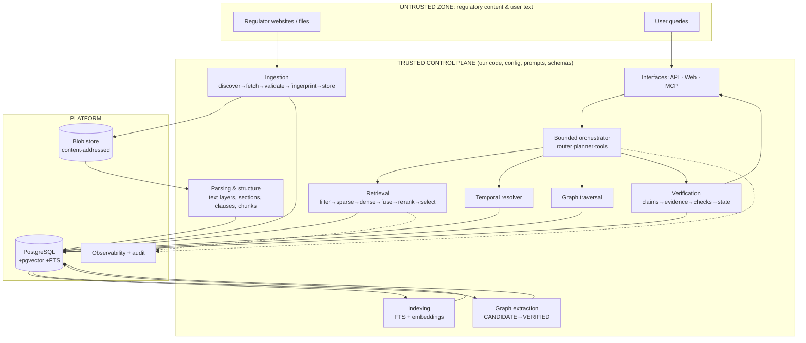

# Architecture

Status: PROPOSED for review (decisions: [ADR-001](adr/ADR-001-system-architecture.md), [002](adr/ADR-002-primary-storage.md), [004](adr/ADR-004-graph-strategy.md), [005](adr/ADR-005-agent-orchestration.md)).

## 1. Horizon

| Horizon | Contents |
|---|---|
| **NOW (Stage 1)** | This foundation: contracts, models, policies, evaluation design, repo governance. No runtime code. |
| **NEXT (Phases 1–11)** | One modular Python backend + PostgreSQL: ingestion, versions, parsing, hybrid retrieval, temporal logic, graph, bounded agent, verification, abstention. |
| **LATER (Phases 12–18+)** | MCP, hardening, API/UI, packaging; then evidence-driven extractions (object storage, queue, search/graph engines, service split) *only if measurements demand*. |

## 2. Logical architecture

The untrusted zone only feeds *data* into the control plane. Nothing in it can change prompts, tool schemas, authorization or configuration.

## 3. Component boundaries and contracts

| Component (package) | Owns | Input → Output (contract in) | May write | Must not |
|---|---|---|---|---|
| `domain` | Types, enums, invariants | — | nothing | import other packages; do I/O |
| `ingestion` | Discovery, fetch, validation, fingerprint, raw storage | SourceManifest → `RawArtifact`, `DocumentVersion` ([ingestion-design](ingestion-design.md)) | source-layer tables, blob store | fetch non-allowlisted hosts; mutate existing versions |
| `ingestion` (parse) | Text layers, structure, chunks | `DocumentVersion` → `TextLayer`, `StructureNode`, `Chunk` | derived-structure tables | discard anchors; execute document content |
| `retrieval` | Filtering, sparse/dense, fusion, rerank, selection | `RetrievalRequest` → `RetrievalResult[]` ([retrieval-design](retrieval-design.md)) | `retrieval_run` records | return results without provenance |
| `graph` | Entity/relation candidates, publish gate, traversal | Chunks/evidence → `KgEdge`; traversal queries | graph tables (extraction jobs only) | publish edge without evidence |
| `evidence` | Anchors, evidence packs, claims, verification | draft/claims + pack → `VerificationResult` ([evidence-model](evidence-model.md)) | claim/verification records | accept free-text citations |
| `agents` | Router, planner, tool dispatch, budgets | `Query` → `AnswerRecord` ([agent-design](agent-design.md)) | run/audit records only | write authoritative/derived data; call unregistered tools |
| `evaluation` | Benchmarks, metrics, ablation runner | cases → metric reports | `data/eval` reports | touch production data |
| `observability` | Trace/log/audit helpers | events → spans/logs | audit/trace tables | log secrets |
| `apps/api`, `apps/web`, MCP adapter | Transport, authN/Z, validation | HTTP/MCP ↔ application services | nothing directly | contain business logic |
| `workers/*` | Entry points that run package jobs | job rows → package calls | via packages | become separate business-logic services |

Dependency direction: `apps/workers → application services → packages → domain`. `agents` depends on retrieval/graph/evidence **read** interfaces only.

## 4. Runtime shape (initial)

One codebase, three entry points, one database:

1. **API process** (FastAPI): serves API and the MCP adapter; runs query-time pipeline synchronously (bounded by budgets).
2. **Worker process** (same image/venv): claims jobs from a Postgres `job` table (`FOR UPDATE SKIP LOCKED`) for ingestion, parsing, embedding, indexing, graph extraction. Idempotent jobs.
3. **PostgreSQL** with pgvector + FTS, plus a **content-addressed blob directory**.

Local development needs only Python, PostgreSQL, and optionally Node for the UI. Docker is optional convenience, not a requirement (it is not installed in the current environment).

## 5. Request flow (query time)

`Query` → normalize → **router** (deterministic rules, then classifier) → [retrieval | + temporal resolver | + graph | + planner loop] → **evidence pack** (ordered, de-duplicated, each item anchored) → draft answer (model, sees pack as data) → **claim extraction** → **verification** (deterministic checks, then entailment) → compose final (drop/downgrade/abstain) → persist `AnswerRecord` + trace → respond. Baseline hybrid retrieval always runs; graph/agentic steps are additive.

## 6. Trust zones

| Zone | Contents | Rules |
|---|---|---|
| Trusted control plane | Code, prompts templates, tool schemas, manifests, authz, config | Version-controlled; reviewed; the only source of instructions |
| Untrusted regulatory content | Fetched files, extracted text, extracted metadata, anything from a model | Stored with `trust_class`; only enters prompts inside data envelopes; never executed |
| Untrusted user input | Queries, MCP arguments | Validated, length-bounded; treated as search data/parameters, not as system instructions |

Details: [security](security.md).

## 7. What is inside the single backend vs. extractable later

| Stays in the monolith | Extraction candidate | Trigger (measured) |
|---|---|---|
| domain, evidence, retrieval, graph, agents, API | Ingestion/parse workers (CPU-heavy PDF work) | Parse load starves query latency |
| Postgres FTS + pgvector | Dedicated search/vector engine | Retrieval benchmark shows ceiling or latency over budget at real scale |
| Relational graph | Graph database | Traversal queries exceed budget at required depth ([ADR-004](adr/ADR-004-graph-strategy.md)) |
| Postgres job table | Message broker | Sustained throughput/ordering needs the table cannot meet |
| Local blob dir | S3-compatible store | Multi-node deployment |
| In-process/Postgres caching | Redis | Cache hit-rate and latency measurements justify it |
| Model providers (already behind interfaces) | Separate inference service | Local-model hosting needed |

## 8. Cross-cutting rules

Every artifact carries `trust_class` ∈ {`SOURCE`, `DERIVED_DETERMINISTIC`, `DERIVED_MODEL`, `RUNTIME`} and its generation versions. All writes to source-layer tables are append-only. All queries run under a request ID ([observability](observability.md)).
