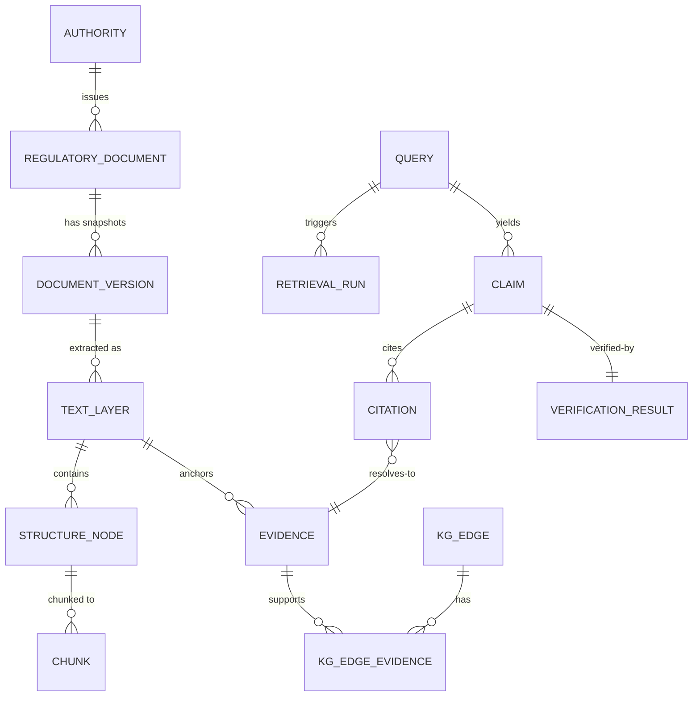

# Domain Model

Pragmatic, not a legal ontology. Objects are grouped by **trust class** (H8). Identifiers are internal UUIDs (v7 preferred for index locality) unless noted; human references (circular numbers, URLs) are *attributes*, never identity.

Legend — **Trust**: `SRC` authoritative source-layer · `DET` derived deterministically · `MOD` model-derived (CANDIDATE until verified) · `RUN` runtime/audit.

## A. Source layer

**Authority** (SRC-config) — regulator or issuing body. Fields: `authority_id` (slug, e.g. `sebi`), name, jurisdiction, allowed hosts, adapter id. Relations: issues Documents. Provenance: manifest in git. Temporal: none.

**RegulatoryDocument** (SRC) — logical instrument (a circular, a regulation, a master circular), independent of any file. Fields: `document_id`, `authority_id`, `document_type`, `source_reference` (issuer's number if present, nullable), `title`, identity key (see [ingestion-design](ingestion-design.md) §4). Relations: has many DocumentVersions; target/source of Amendments, Supersessions, references. Provenance: first-seen source URL + manifest entry. Temporal: container only; dates live on versions.

**DocumentVersion** (SRC, immutable) — one distinct retrieved content snapshot of a document. Fields: `document_version_id`, `document_id`, `content_hash` (sha256 of raw bytes), `canonical_url`, `retrieved_at`, `raw_artifact_ref`, `source_id`, `ingest_run_id`, version label if issuer-stated, `supersedes_version_id` only for *content* lineage at the same canonical location. Temporal: carries `DateAssertion`s (publication, approval, effective, …) — see [temporal-model](temporal-model.md). **Note:** "DocumentVersion" = a retrieved snapshot, *not* a legal "amended state"; legal states are derived (Amendment/Supersession).

**TextLayer** (DET, immutable) — extracted text for a version by a given extractor. Fields: `text_layer_id`, `document_version_id`, `extractor_version`, `text_hash`, page map. All evidence offsets refer to a TextLayer.

**Section / Clause** (DET) — structural nodes (`StructureNode` with `kind` = PART/CHAPTER/SECTION/CLAUSE/SUBCLAUSE/ANNEXURE/TABLE…). Fields: `node_id`, `text_layer_id`, `parent_id`, `ordinal`, `label` (e.g. "3.2(a)" as printed), `start_offset`, `end_offset`, `page_start/end`, `parser_version`. Provenance: parse run. Temporal: inherit from the version; amendment effects are modelled separately.

**Definition** (DET/MOD) — a defined term and its text within a document/version scope. Fields: `term`, `definition_node_id`, `scope`. Source: anchored to the defining clause. Temporal: scoped to the version.

## B. Derived layer (anchored to source)

**Amendment** (DET/MOD → verified) — a statement that document A modifies target T. Fields: `amendment_id`, `source_document_version_id`, `target_document_id` (+ optional `target_node_ref`), `operation` (INSERT/SUBSTITUTE/DELETE/OMIT/UNSPECIFIED), `scope` (FULL/PARTIAL), `date assertions` (published/effective), status, `evidence_id`s. Never auto-applies text; consolidated views are derived and labelled non-authoritative.

**Supersession** (derived, anchored) — explicit statement that X replaces/withdraws Y (whole or part). Fields: `superseding_ref`, `superseded_ref`, `scope`, `effective` DateAssertion, evidence. Created only from explicit text or manual curation ([ADR-007](adr/ADR-007-temporal-and-supersession-policy.md)).

**EffectivePeriod** (derived) — computed `[from, to)` per (document version, optional clause) with `basis` pointers to the DateAssertions and relations used and a `confidence_class` (EXPLICIT / DERIVED_FROM_TEXT / UNKNOWN). Recomputable; versioned by `temporal_rules_version`.

**Obligation** (MOD → VERIFIED) — atomic normative statement. Fields: `obligation_id`, `source_node_id`, `evidence_id`, `modality` (MUST/MUST_NOT/MAY/SHOULD), `subject_text`, `action_text`, `condition_text`, extraction method/version. Never paraphrase-only: always carries the exact anchored span.

**Requirement** (curated grouping, DEFERRED for implementation) — optional named grouping of obligations (e.g., a compliance topic). Include only if benchmark shows need; do not pre-build.

**Exception** (MOD → VERIFIED) — carve-out text modifying an Obligation's scope. Fields: `exception_id`, `obligation_id`, `evidence_id`, `condition_text`.

**EntityType / Product / Activity** (MOD/curated) — regulated-party type, instrument/product, activity. Stored as `kg_entity` with `entity_class`. Fields: canonical name, aliases, optional external IDs. Provenance: first-mention evidence; curated vocab for the initial domain recommended over free extraction.

**ApplicabilityRule** (MOD → VERIFIED) — structured scope of an Obligation/Exception: which EntityTypes/Products/Activities and conditions. Anchored to the same clause; separate from Obligation so applicability can be re-extracted independently.

**Entity / Relation** — generic graph node/edge (`kg_entity`, `kg_edge`) with `status` (CANDIDATE/VERIFIED/REJECTED), `confidence` (extractor-reported, uncalibrated), `method`, `extraction_version`. See [graph-schema](graph-schema.md).

**RegulatoryChange** (DET/MOD) — an observed difference between two document states: `change_id`, `from_version_id`, `to_version_id` (or from/to as-of dates), `change_type` (ADDED/REMOVED/MODIFIED), `before_evidence_id`, `after_evidence_id`, linked Obligation(s). Provenance: diff run + versions.

**ImpactAssessment** (RUN/MOD) — report object: `assessment_id`, `query_id`, subject (change set / entity set), findings (each a Claim with verification), disposition, `generated_at`, versions. Always labelled decision-support.

## C. Evidence & runtime layer

**Evidence** (DET, immutable) — anchored span: `evidence_id` (deterministic hash of `text_layer_id,start,end`), `text_layer_id`, offsets, `quote_hash`, node/page info, `document_version_id`, `canonical_url`. See [evidence-model](evidence-model.md).

**Claim** (RUN/MOD) — atomic assertion extracted from a draft answer or report: text, type (REQUIREMENT/DATE/NUMERIC/ENTITY/RELATION/CHANGE/OTHER), as-of date, `query_id`.

**Citation** (RUN) — link Claim → Evidence with role (SUPPORTS/CONTRADICTS/CONTEXT) and rendered handle; exists only if the Evidence row exists.

**VerificationResult** (RUN) — per claim: `state` ∈ {SUPPORTED, PARTIALLY_SUPPORTED, CONTRADICTED, INSUFFICIENT_EVIDENCE, TEMPORALLY_AMBIGUOUS}, check outcomes (anchor, hash, temporal, numeric, entailment), verifier versions, rationale (model text is explanation only).

**Query** (RUN) — `query_id`, normalized text, parsed as-of date/filters, route decision, principal, `request_id`.

**RetrievalRun** (RUN) — one retrieval invocation: parameters, index versions, candidate lists per stage with scores, final selection ([retrieval-design](retrieval-design.md)).

**AuditEvent** (RUN, append-only) — who/what/when/which versions for material actions (tool calls, publishes, authorization decisions). See [observability](observability.md).

## D. Key relationships (summary)

Global rules: (1) every non-SRC record stores the versions that produced it; (2) no derived object is stored without a pointer to the Evidence/StructureNode it came from, except RUN records whose provenance is the retrieval/verification trace; (3) deletion is logical (`superseded_by`/`status`), never silent.
